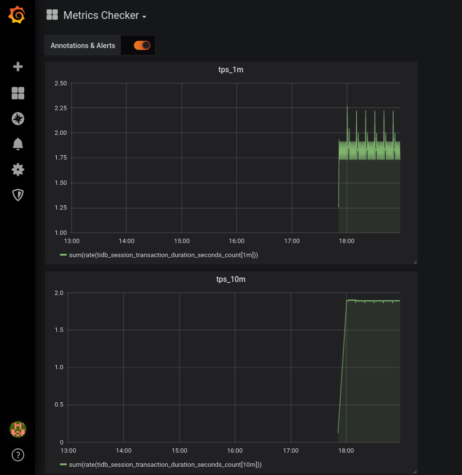

# Metrics Checker
To check metrics fetched from prometheus during testing tidb and other PingCAP products.

Check [develop note](./doc/develop_note.md) for roadmap, TODOs and external documentations.

## Quick Start
```yaml
rules:
    - tag: tps
      promql: sum(rate(tidb_session_transaction_duration_seconds_count[5m])) > bool sum(rate(tidb_session_transaction_duration_seconds_count[10m]))
        # Place the PromQL you want to check here.
        # They should return a bool value.
```

Minimum config file.
- Place it in [./config.yaml](./config.yaml), or `--config {filepath}`.
- Pass it with `--config-base64` flag. This will override the former method.

Specify the prometheus address and run:
```bash
$ ./metrics-checker --address 127.0.0.1:9090
2021/01/25 15:21:07 Start checking metrics after 0s
2021/01/25 15:21:07 Start checking metrics
2021/01/25 15:21:07 Prometheus address: http://127.0.0.1:9090
2021/01/25 15:21:07 checking query: sum(rate(tidb_session_transaction_duration_seconds_count[5m])) > bool sum(rate(tidb_session_transaction_duration_seconds_count[10m]))
```

### Visualization with grafana
Add metrics you want to show in config.yaml:
```yaml
metrics-to-show:
  tps_1m: sum(rate(tidb_session_transaction_duration_seconds_count[1m]))
  tps_10m: sum(rate(tidb_session_transaction_duration_seconds_count[10m]))
```

Specify grafana api address with `--grafana` flag, metrics-checker will create a dashboard named "Metrics Checker".
```bash
$ ./metrics-checker --address 127.0.0.1:9090 --grafana 127.0.0.1:3000
```


## Examples of config file
Examples are in [config_examples](config_examples/) directory.
```yaml
start-after: 30s  # optional, default = 0s
interval: 10s     # optional, default = 1m
rules:    # If PromQL in rules are false, metrics-checker will exit.
    - tag: tps
      promql: sum(rate(tidb_session_transaction_duration_seconds_count[5m])) > bool sum(rate(tidb_session_transaction_duration_seconds_count[10m]))  # PromQL here should return a bool value.
metrics-to-show:  # optional, generate dashboard of those metrics in grafana when `--grafana` flag is set.
  tps_1m: sum(rate(tidb_session_transaction_duration_seconds_count[1m]))
  tps_10m: sum(rate(tidb_session_transaction_duration_seconds_count[10m]))
```

Config can also passed by base64 string
```bash
./metrics-checker --config-base64 c3RhcnQtYWZ0ZXI6IDEwMHMKaW50ZXJ2YWw6IDEwcwpydWxlczogICAgIyDlr7kgcHJvbWV0aGV1cyBhcGkg55qEIHF1ZXJ5CiAgICAtIHRhZzogdHBzCiAgICAgIHByb21xbDogc3VtKHJhdGUodGlkYl9zZXNzaW9uX3RyYW5zYWN0aW9uX2R1cmF0aW9uX3NlY29uZHNfY291bnRbMW1dKSkgPiBib29sIDIvMyAqIHN1bShyYXRlKHRpZGJfc2Vzc2lvbl90cmFuc2FjdGlvbl9kdXJhdGlvbl9zZWNvbmRzX2NvdW50WzVtXSkpCg==

...
2021/01/26 09:58:37 Load config from base64 string
2021/01/26 09:58:37 Start checking metrics after 1m40s
```

## Use checker in a container
You can pass config.yaml as base64 string with `--config-base64` flag, as it may be inconvenient to copy a file into containers.

Example:
```bash
docker run -it --rm localhost/metrics-checker:latest metrics-checker --config-base64 c3RhcnQtYWZ0ZXI6IDBzCmludGVydmFsOiAxMHMKcnVsZXM6ICAgICMg5a+5IHByb21ldGhldXMgYXBpIOeahCBxdWVyeQogICAgLSB0YWc6IHRwcwogICAgICBwcm9tcWw6IHN1bShyYXRlKHRpZGJfc2Vzc2lvbl90cmFuc2FjdGlvbl9kdXJhdGlvbl9zZWNvbmRzX2NvdW50WzFtXSkpID4gYm9vbCAyLzMgKiBzdW0ocmF0ZSh0aWRiX3Nlc3Npb25fdHJhbnNhY3Rpb25fZHVyYXRpb25fc2Vjb25kc19jb3VudFs1bV0pKQo= --address 192.168.1.164:9090
```